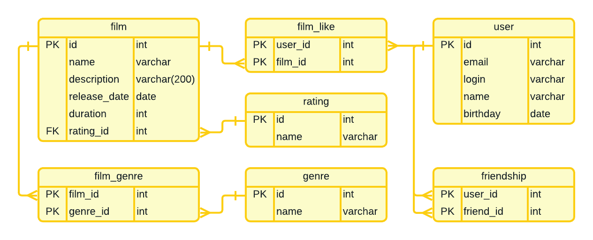

# java-filmorate

## ER-диаграмма

## Запросы для основных операций приложения
### 1. Film
1.1. Получение всех фильмов - getFilms():

    SELECT f.id,
           f.name,
           f.description,
           f.release_date,
           f.duration,
           r.name AS rating
    FROM film AS f
    JOIN rating AS r ON f.rating_id = r.id;

1.2. Получение фильма по id - getFIlmById():

    SELECT f.id,
           f.name,
           f.description,
           f.release_date,
           f.duration,
           r.name AS rating
    FROM film AS f
    JOIN rating AS r ON f.rating_id = r.id
    WHERE f.id = <id>;

1.3. Получение списка наиболее популярных фильмов - getPopularFilms():

    SELECT f.id,
           f.name,
           f.description,
           f.release_date,
           f.duration,
           r.name AS rating
    FROM film AS f
    JOIN rating AS r ON f.rating_id = r.id
    JOIN film_like AS fl ON f.id = fl.film_id
    GROUP BY f.id
    ORDER BY COUNT(fl.user_id) DESC
    LIMIT <limit>;

1.4. Добавление фильма - addFilm():

    INSERT INTO film (id, name, description, release_date, duration, rating_id)
    VALUES (<id>, <name>, <description>, <release_date>, <duration>, <rating_id>);

1.5. Обновление фильма - updateFilm():

    UPDATE film
    SET name = <name>,
        description = <description>,
        release_date = <release_date>,
        duration = <duration>,
        rating_id = <rating_id>
    WHERE id = <id>;

1.6. Удаление фильма по id - deleteFIlmById():

    DELETE FROM film
    WHERE id = <id>

1.7. Добавление лайка к фильму - addLike():

    INSERT INTO film_like (user_id, film_id)
    VALUES (<user_id>, <film_id>);

1.8. Удаление лайка к фильму - deleteLike():

    DELETE FROM film_like
    WHERE user_id = <user_id> AND film_id = <film_id>;

1.9. Добавления жанра фильма - addFilmGenre():

    INSERT INTO film_genre (film_id, genre_id)
    VALUES (<film_id>, <genre_id>);

1.10. Удаление жанра фильма - deleteFilmGenre():

    DELETE FROM film_genre
    WHERE film_id = <film_id> AND genre_id = <genre_id>;

### 2. User
2.1. Получение всех пользователей - getUsers():

    SELECT * FROM user;

2.2. Получение пользователя по id - getUserById():

    SELECT * FROM user
    WHERE id = <id>;

2.3. Получение всех друзей (подписок) пользователя - getSubListById():

    SELECT u.id,
           u.email,
           u.login,
           u.name,
           u.birthday
    FROM user AS u
    JOIN friendship AS sub ON u.id = sub.friend_id
    WHERE sub.user_id = <id>;

2.4. Получение подтвержденных друзей пользователя - getFriendsListById():

    SELECT u.id,
           u.email,
           u.login,
           u.name,
           u.birthday
    FROM user AS u
    JOIN friendship AS sub ON u.id = sub.friend_id
    JOIN friendship AS resp ON sub.user_id = resp.friend_id
    WHERE sub.user_id = <id> AND resp.user_id = sub.friend_id;

2.5. Получение списка обших друзей с пользователем - getCommonFriends():

    SELECT u.id,
           u.email,
           u.login,
           u.name,
           u.birthday
    FROM user AS u
    JOIN friendship AS sub ON u.id = sub.friend_id
    JOIN friendship AS resp ON sub.user_id = resp.friend_id
    JOIN friendship AS sub_common ON resp.user_id = sub_common.friend_id
    JOIN friendship AS resp_common ON sub_common.user_id = resp_common.friend_id
    WHERE sub.user_id = <id> AND resp.user_id = sub.friend_id 
    AND resp_common.friend_id = <other_id> AND resp_common.user_id = sub_common.friend_id;

2.6. Добавление нового пользователя - addUser():

    INSERT INTO user (id, email, login, name, birthday)
    VALUES (<id>, <email>, <login>, <name>, <birthday>);

2.7. Обновление пользователя - updateUser():

    UPDATE user
    SET email = <email>,
        login = <login>,
        name = <name>,
        birthday = <birthday>
    WHERE id = <id>;

2.8. Удаление пользователя по id - deleteUserById():

    DELETE FROM user
    WHERE id = <id>;

2.9. Добавление друга для пользователя (подписка) - addFriend():

    INSERT INTO friendship (user_id, friend_id)
    VALUES (<user_id>, <friend_id>);

2.10. Удаление пользователя из друзей (отписка) - deleteFriend():

    DELETE FROM friendship
    WHERE user_id = <user_id> AND friend_id = <friend_id>;